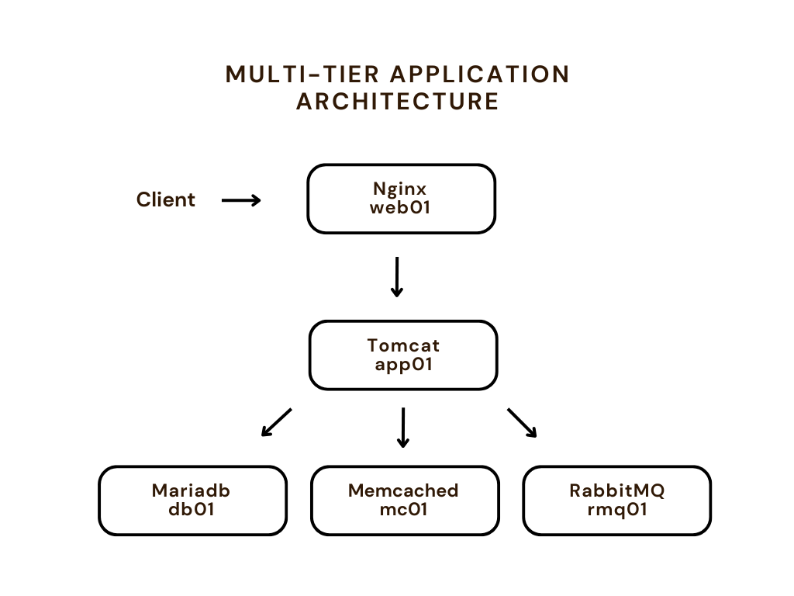
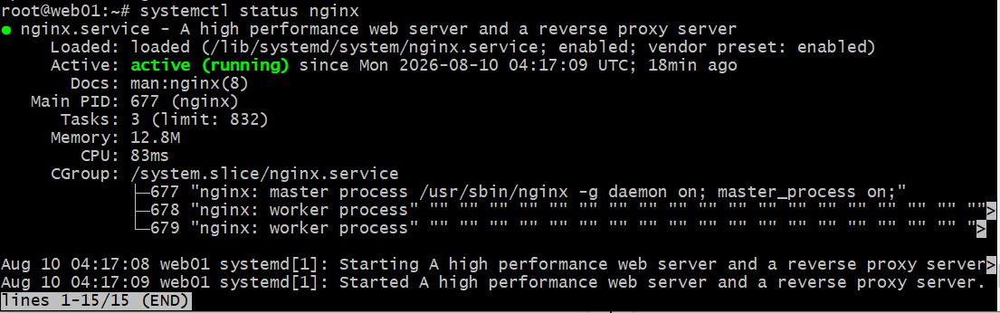
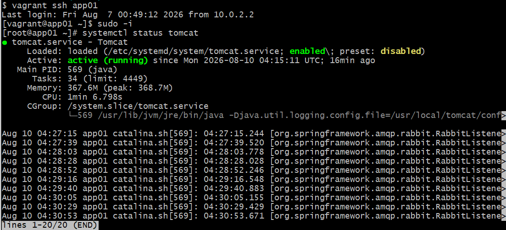
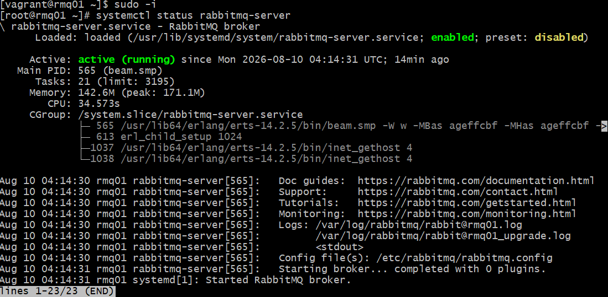
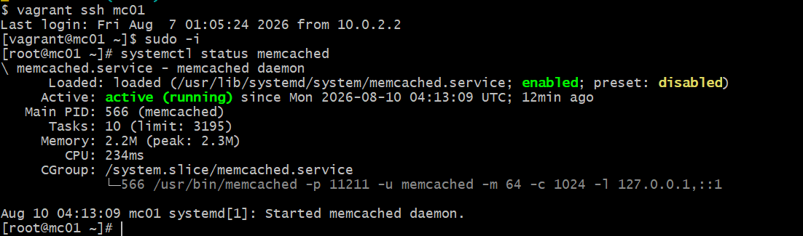
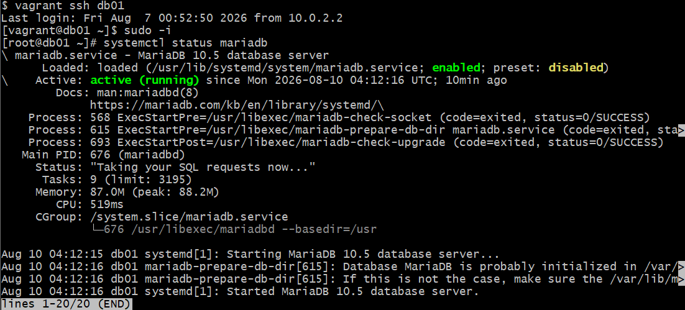

# Multi-Tier DevOps Environment Using Vagrant

## Overview

This project demonstrates a multi-tier application environment
using Vagrant and VirtualBox.

Five virtual machines are provisioned, with each VM running
a different service.

## Architecture



## Virtual Machines

| VM | Hostname | IP Address | Service |
|---|---|---|---|
| VM1 | db01 | 192.168.56.15 | MariaDB |
| VM2 | mc01 | 192.168.56.14 | Memcached |
| VM3 | rmq01 | 192.168.56.13 | RabbitMQ |
| VM4 | app01 | 192.168.56.12 | Tomcat |
| VM5 | web01 | 192.168.56.11 | Nginx |

## Service Verification

The following screenshots demonstrate that the services are successfully
installed and running on their respective virtual machines.

### 1. Nginx - web01

Nginx is running successfully on the web server.



### 2. Tomcat - app01

Tomcat is running successfully on the application server.



### 3. RabbitMQ - rmq01

RabbitMQ is running successfully on the message broker server.



### 4. Memcached - mc01

Memcached is running successfully on the caching server.



### 5. MariaDB - db01

MariaDB is running successfully on the database server.



## Technologies Used

- Vagrant
- VirtualBox
- CentOS Stream 9
- Ubuntu 22.04
- Nginx
- Apache Tomcat
- RabbitMQ
- Memcached
- MariaDB

## Project Setup

### Prerequisites

- VirtualBox
- Vagrant
- Vagrant Host Manager plugin

### Clone the Repository

```bash
git clone https://github.com/adilhafeez1993/Multi-Tier-Devops-Environment-using-vagrant
cd multi-tier-devops-vagrant

